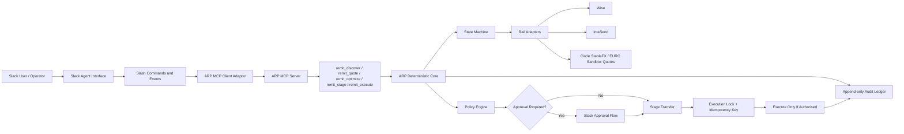

# Slack Agent Architecture

## Overview

The Slack Agent integration turns Slack into an operator and approval surface for ARP workflows.

Slack is not the execution layer. Slack is a channel adapter.

ARP remains responsible for policy, state, execution locks, idempotency, and auditability.

> **AI reasons. MCP exposes tools. ARP enforces. Partner rails execute.**

Slack users and operators interact through slash commands. The Slack Agent converts messages into structured ARP tool requests. Neither Slack nor an LLM moves funds directly — ARP enforces sender policy, staged execution, and append-only audit logging before any partner rail adapter is invoked.

## Architecture Diagram



## Component Responsibilities

| Layer | Responsibility |
| :--- | :--- |
| **Slack Agent** | Channel adapter; parses slash commands; never executes funds |
| **ARP MCP Client** | Translates Slack workflows into MCP tool calls |
| **ARP MCP Server** | Exposes `stage_intent`, `get_routing_quote`, `execute_transfer`, and related tools |
| **Policy Engine** | Tier limits, consent class, approval requirements |
| **State Machine** | Staging, execution locks, idempotency keys |
| **Rail Adapters** | Wise, IntaSend, Circle StableFX sandbox quotes, Swypt (validation) |
| **Audit Ledger** | Append-only event history per transfer |

## Integration Status

- **Slack Agent wrapper:** integration scaffold (`integrations/slack/`)
- **Slash command handlers:** local development implementation
- **ARP MCP tool calls:** routed through `arp_client.py` adapter (mock-safe by default)
- **Production Slack deployment:** requires `SLACK_BOT_TOKEN`, `SLACK_SIGNING_SECRET`, `SLACK_APP_TOKEN`
- **Circle StableFX / EURC:** sandbox quote testing only; production execution planned
- **EURC→M-Pesa:** technical validation; not confirmed production

## Safety Invariants

1. Slack messages never bypass ARP policy.
2. Out-of-policy transfers require explicit `/st4bl approve` before ARP execution.
3. Rejected transfers (`/st4bl reject`) record audit events; no funds move.
4. Real partner rail execution is disabled unless `ARP_ENABLE_REAL_EXECUTION` is explicitly set.
5. Gemini, Qwen, MCP, AP2, A2A, x402, and ERC-8004 integrations remain independent reasoning and attestation surfaces — Slack is an additional enterprise channel alongside Telegram.

## Local Development

```bash
pip install -e ".[slack]"
python examples/slack_agent_demo.py
python integrations/slack/slack_agent.py   # requires Slack credentials
```
