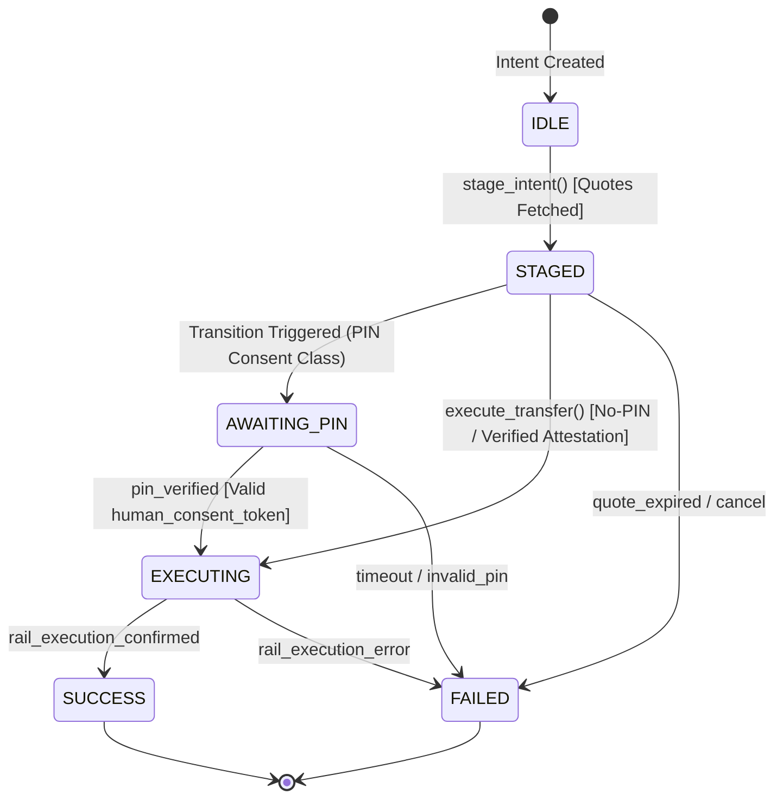

# Agent Remittance Protocol (ARP) Technical Specification

This document details the core protocols, invariants, models, state machine transitions, and policy frameworks for the Agent Remittance Protocol (ARP). ARP serves as a consent-enforced, multi-rail routing, and non-custodial treasury execution layer for autonomous AI agents handling cross-border payments.

## Integration Status (Summary)

| Rail / Component | Status |
| :--- | :--- |
| Wise EUR→KES | Live fiat rail where configured |
| IntaSend / M-Pesa B2C | Integrated for Kenya payout flows |
| Circle StableFX / EURC | Sandbox integrated for EUR→EURC quote testing only |
| Circle production execution | Planned grant milestone |
| Swypt USD→USDT→M-Pesa | Confirmed by partner |
| Swypt EURC→M-Pesa | In technical validation; not yet confirmed |
| qwen3.5-flash | Live Qwen Cloud reasoning runtime (reasoning only) |
| Gemini 3.5 Flash | Gemini reasoning runtime (reasoning only) |

Gemini and Qwen are reference reasoning runtimes. ARP is the deterministic execution and safety layer. LLMs do not execute funds.

---

## 1. Core Lifecycle State Machine

The life of a remittance intent flows through a deterministic, strictly enforced finite state machine. Transactions start as simple intents and transition securely to execution or failure.

### 1.1 States Definitions
- **IDLE**: The initial phase where transaction parameters (sender, recipient, amounts) are defined but routing or quotes have not yet been queried or bound.
- **STAGED**: Dynamic multi-rail quotes have been fetched, bound to the intent, and a specific optimal route is selected. An idempotency key is generated and locked.
- **AWAITING_PIN**: Requires explicit human PIN/Consent validation. High-security tier transfers block here until a verifiable signature or PIN is supplied.
- **EXECUTING**: The transaction is locked. It has entered the payment rail processing system. No attributes can be mutated in this state.
- **SUCCESS**: Payout is complete, settled by the payout partner (e.g., M-Pesa). The receipt has been minted, hashed, and archived.
- **FAILED**: Terminal error state.

---

## 2. Core Protocol Invariants & Guardrails

To operate safely under non-custodial and autonomous agent environments, the protocol enforces four strict invariants:

1. **Idempotency Keys (UUID4)**: Generated deterministically during staging. Once an intent is STAGED, its idempotency key is immutable and binds uniquely to the payload to prevent double-spends.
2. **Execution Locks**: The moment an intent enters `EXECUTING`, an atomic database or memory lock is set: `execution_lock = True`. Any incoming API calls or agents attempting to mutate parameters (amounts, assets, recipients) are immediately rejected with an `ExecutionLockActiveException`.
3. **No Automated Retries on Executing Failures**: To prevent downstream double-send scenarios on unstable rails (e.g., mobile money timeouts), the state machine explicitly forbids auto-retries when entering `FAILED` during active execution. Human operators or out-of-band resolution must verify rail state.
4. **LLM/Agent Isolation**: AI Agents can stage intents, query quotes, and trigger validation checks, but they **cannot** formulate HTTP payloads for financial settlement, access client keys, or bypass any policy invariants.

---

## 3. M-Pesa Tier Optimization Spec

Cross-border corridors ending in Safaricom M-Pesa in Kenya are sensitive to boundary withdrawal fees. Recipient cash-out charges depend on the exact amount sent. ARP implements three recipient-preservation rounding policies:

- **ROUND_DOWN**: Calculates the exact M-Pesa withdrawal fee bracket for the payout amount and subtracts it from the source conversion to ensure the recipient receives an exact round number in KES (e.g., exactly 10,000 KES instead of 10,028 KES) so they don't lose value to cash-out fee remainders.
- **SPLIT**: Deducts transaction and cash-out charges proportionally, splitting the friction fee between the sender's coverage budget and recipient's payout value.
- **EXACT**: The recipient receives exactly the quote target amount. All withdrawal fees are calculated upfront, mapped to M-Pesa tariff tables, and added to the sender's required funding source.

---

## 4. AP2 & ERC-8004 Concept Integration

- **AP2 (Agent Payments Protocol)**: Agents express credentials using out-of-band JWTs or credentials known as **Mandates** (IntentMandates, CartMandates, PaymentMandates). Consent is verified by checking the cryptographic signatures of these credentials.
- **ERC-8004 Compliance**: Agent identities are anchored on-chain. When high-value institutional tiers require validation, the system queries the ERC-8004 Validation Registry to assert the agent is authorized by its parent corporate entity and has a sufficient reputation score.
